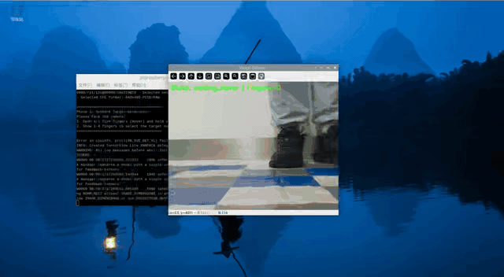
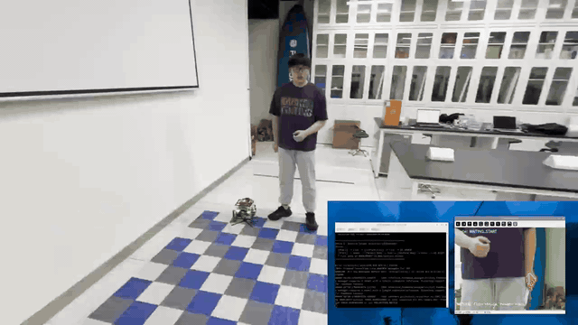

# Vision-Guided Intelligent Fire-Rescue UAV System

This project is an integrated UAV system that combines **gesture interaction**, **ArUco-based visual localization**, **OCR digit recognition**, and **autonomous flight control**.  
Built on Raspberry Pi 5 and Picamera2, it is designed to simulate unmanned reconnaissance tasks in fire-rescue scenarios.

---

## 🌟 Key Features

1. **Robust Interaction**
   - MediaPipe-based hand gesture recognition.
   - Temporal sliding-window filtering and a double-confirmation state machine to reduce false triggers.
   - Global reset with fist gesture.

2. **Dual-Mode Operation**
   - **Mode A (ArUco Mode):** pure visual following using ArUco markers for pose synchronization.
   - **Mode B (Digit Mode):** intelligent digit reconnaissance with target search and capture.

3. **Autonomous Closed-Loop Decision-Making**
   - **Spatial attention mechanism:** uses ArUco gate detection to localize ROI and suppress background interference.
   - **Self-recovery search:** if OCR result does not match the target, the UAV automatically switches back to search mode until the mission is completed.

---

## 🎬 Demo Videos

### 1) OCR Digit Recognition



Demo link (GIF): [recognition.gif](assets/gifs/recognition.gif)  
Original video (MP4): [recognition.mp4](assets/videos/recognition.mp4)

### 2) ArUco Visual Following



Demo link (GIF): [following.gif](assets/gifs/following.gif)  
Original video (MP4): [following.mp4](assets/videos/following.mp4)

> If GIF loading is slow, use the MP4 links above.

---

## 🛠️ Requirements

Make sure Raspberry Pi is connected to Picamera2 and the flight controller (UART).

```bash
# 1) Activate virtual environment
source ~/rpi_env/bin/activate

# 2) Install dependencies
pip install -r requirements.txt
```

Key libraries:
- `opencv-python` (vision processing)
- `mediapipe` (gesture recognition)
- `easyocr` (digit recognition)
- `picamera2` (camera interface)
- `torch` (deep-learning backend)

---

## 🚀 Quick Start

### 1) Launch the system

```bash
python vision_final.py
```

### 2) Interaction flow (Phase 1)

After startup, stand in front of the camera and use hand gestures:

| Target Mode | Trigger Gesture | Confirmation | Description |
| :-- | :-- | :-- | :-- |
| **ArUco Following Mode** | **✊ Fist** | Hold for 1 second | Calls `aruco_dectction_pi5`; UAV follows the ArUco marker. |
| **Digit Reconnaissance Mode** | **🖐️ Open Palm (Hover)** | Open palm again | Starts the intelligent closed-loop search for target digits. |
| **Global Reset** | **✊ Fist** | Any phase | Immediately returns to the initial state. |

> **Digit selection:** In Digit Mode, show **1, 2, 3, or 4** fingers to select the target number, then show open palm again to confirm and start.

### 3) Mission flow (Phase 2, Digit Mode only)

Once the target digit is confirmed, the UAV runs the following closed loop:

1. **LOCK Search:** flies right for 3 seconds to look for the gate.
2. **HOVER Detection:** hovers and waits until a complete gate (4 ArUco markers) is detected.
3. **OCR Recognition:**
   - ✅ **Match:** logs success, captures a photo to `/home/pi/captured_images`, mission completed.
   - ❌ **Mismatch:** logs "Mismatch", automatically switches back to **LOCK Search**.

---

## 📂 File Structure

```text
.
├── vision_final.py          # Main program: gesture interaction + closed-loop search (recommended)
├── test2.py                 # OCR logic test script (without complex gesture workflow)
├── aruco_dectction_pi5.py   # External ArUco-following module called by the main program
├── datalink_serial.py       # Flight-controller communication interface (MAVLink wrapper)
├── biaoding.py              # Monocular ranging and camera distortion calibration
├── assets/
│   ├── gifs/
│   │   ├── recognition.gif  # OCR digit-recognition demo GIF
│   │   └── following.gif    # ArUco visual-following demo GIF
│   └── videos/
│       ├── recognition.mp4  # OCR digit-recognition demo video
│       └── following.mp4    # ArUco visual-following demo video
├── requirements.txt         # Dependency list
└── readme.md                # Project documentation
```

---

## ⚠️ Safety & Notes

1. **Emergency stop**
   - Press **`s`** during runtime to send stop commands.
   - Press **`q`** to exit the program.

2. **Camera resource conflict**
   - `vision_final.py` releases camera resources automatically when entering ArUco mode for external script calls.
   - Do not force-kill the process, otherwise the camera may stay occupied (restart may be required).

3. **Lighting and environment**
   - OCR is sensitive to lighting. Grayscale preprocessing and adaptive scaling are included, but strong backlight can still degrade accuracy.
   - Recommended ArUco gate size is around 15-20 cm in real scenes for better ROI extraction.

---

## 📝 Project Info

- **Project:** Final Project for Microprocessors and Microsystems - Intelligent Fire-Rescue UAV
- **Developers:** Weiyi Hu (12313505) and Ruiyi Yao (12312816)
- **Date:** 2026-01-03
